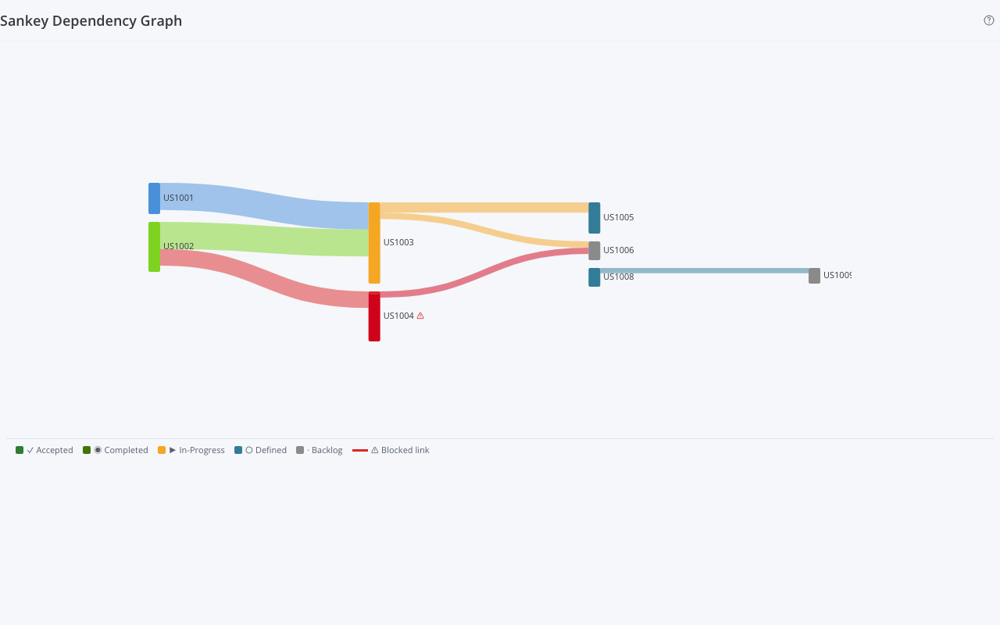

# Sankey Dependency Graph

A Rally Custom View widget that visualizes predecessor/successor dependency relationships between User Stories as an interactive Sankey flow diagram.



---

## What it does

Fetches User Stories from the current project scope and renders a **Sankey diagram** where:

- **Nodes** represent User Stories (rectangles)
- **Links** represent dependency relationships — a link from Story A to Story B means B depends on A (A is a Predecessor of B)
- Node width and color encode ScheduleState and estimate
- Blocked stories display a red stripe; blocked dependency links are drawn in red
- Hovering a node shows a tooltip with the full story name, state, estimate, and blocked reason
- Double-clicking a node opens the story's detail page in Rally

---

## Features

| Feature | Details |
|---------|---------|
| Dependency visualization | Predecessor/Successor chains rendered as a layered Sankey flow |
| Blocked indicators | Red stripe on blocked story nodes; red links to blocked stories |
| ScheduleState coloring | Defined, In-Progress, Completed, Accepted, Backlog each get a distinct color |
| Custom DisplayColor | If a story has a Rally Display Color set, that color overrides the state color |
| Tooltip | Hover any node: full name, state, story points, blocked reason |
| Rally deep-link | Double-click any node to open the story detail page in a new tab |
| Isolated node toggle | Settings: show/hide stories with no dependencies in scope |
| Query filter | Settings: add a WSAPI filter to narrow the scope (e.g. by Iteration) |
| Accessibility | Symbol + text labels alongside color; keyboard-navigable nodes (Enter/Space to follow link) |

---

## Settings

| Setting | Default | Description |
|---------|---------|-------------|
| Additional Filter | _(empty)_ | WSAPI query string to restrict which stories appear, e.g. `(Iteration.Name = "Sprint 42")` |
| Show isolated stories | Off | When on, stories with no in-scope predecessor/successor links are shown as disconnected nodes |

Access settings by clicking the gear icon in the widget chrome (Rally Edit Mode).

---

## Data fetched

- **Type:** `HierarchicalRequirement` (User Stories)
- **Fields:** `ObjectID, FormattedID, Name, PlanEstimate, ScheduleState, Blocked, BlockedReason, DisplayColor, Predecessors, Successors`
- **Scope:** Current project (with ProjectScopeDown), filtered by any query set in settings
- **Max:** 2,000 stories per load (WSAPI pagesize limit)

---

## Legacy source

Ported from **SankeyDependencyChart** — a Rally Custom Page (ExtJS SDK 2.0rc2) app that used an embedded D3 Sankey plugin.

Original features preserved:
- Sankey diagram with predecessor/successor links
- Blocked link styling (red stroke)
- Node labels with FormattedID and story points
- Double-click navigation to story detail
- Color-by-ScheduleState

Changes from legacy:
- Sankey layout algorithm re-implemented in pure TypeScript/SVG (no D3 dependency) — matches the legacy's `sankey.layout(32)` iteration count, `nodeWidth=15`, `nodePadding=10` parameters
- Added accessible tooltips (hover) with full story detail
- Added keyboard navigation (Tab + Enter/Space to open story in Rally)
- Added legend for color meanings
- Settings panel via `@customagile/widget-ai` EditModePanel

---

## Development

```bash
# From the examples/sankey-dependency-graph folder:
npm install
npm run dev        # Mock data, http://localhost:5175

# With live Rally data:
# Create auth.json: { "server": "https://rally1.rallydev.com", "apiKey": "_..." }
npm run dev        # Add ?live=true to the URL
```

```bash
npm run build        # Production build (live data)
npm run build:mock   # Mock data build
npm run typecheck    # TypeScript check
```

---

## Mock data scenario

The mock data models a "Platform Modernisation" sprint dependency chain:

```
US1001 (Auth Service)  ──► US1003 (API Gateway)  ──► US1005 (Mobile App)
                                                   └──► US1006 (Analytics)
US1002 (DB Schema)     ──► US1003 (API Gateway)
US1002 (DB Schema)     ──► US1004 (Report Engine) ──► US1006 (Analytics)
US1008 (Notif. Svc)    ──► US1009 (Onboarding)
US1007 (CI Pipeline)   — isolated (no deps)
```

`US1004` is marked Blocked (awaiting data model sign-off) to demonstrate the red blocked indicator.

---

## Dependencies

| Package | Reason |
|---------|--------|
| `@customagile/widget-ai` | Widget SDK — tokens, AppHeader, EditModePanel, settings hooks |

The Sankey layout is implemented in pure TypeScript/SVG with no third-party charting library. The original app used a minified D3 Sankey plugin; this port re-implements the same layout algorithm directly to avoid the dependency.
